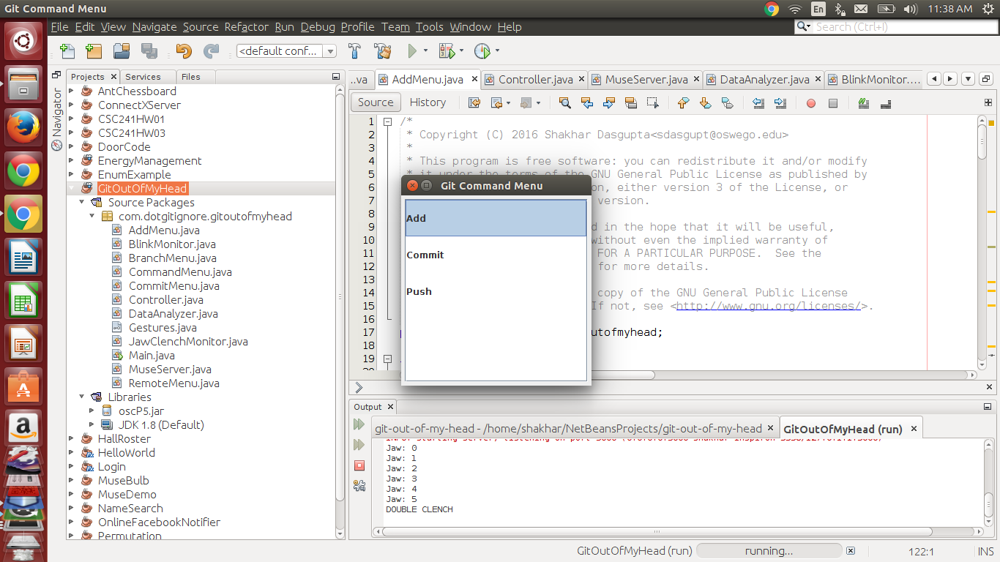

# git-out-of-my-head
A program which allows one to control Git using a Muse headband.



## Usage
The program has a set of general controls which are used throughout its various menus:

* Single Jaw Clench - Select item
* Double Jaw Clench - Open command menu / close current menu
* Single Blink - Move down
* Double Blink - Toggle checkbox

The program starts out in a dormant state with no window open. You can open the command menu by performing a double jaw clench. You can then move through the commands by performing single blinks, and select a command by performing a single jaw clench.

From the command menu you can access the various menus that the program has for different git commands.

## Development
The following sections include information on the development of Git Out Of My Head.

### Running from source
The program can be run from source by executing the following command within the main directory of the project:

```
make run
```

### Compiling jar
The program can be compiled into a jar file by running the following command within the main directory of the project:

```
make jar
```
